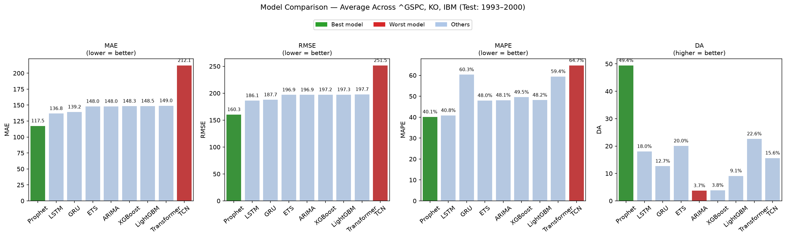
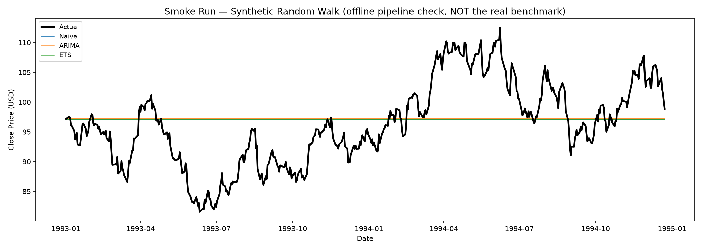

# Stock Forecast Benchmark

> Comparing **9 time-series forecasting models** on historical stock data.
> **Train:** 1962–1992 &nbsp;|&nbsp; **Test:** 1993–2000 &nbsp;|&nbsp; **Tickers:** ^GSPC, KO, IBM

[](https://github.com/hurjun/stock-forecast-benchmark/actions/workflows/ci.yml)
[](LICENSE)
[](https://www.python.org/)

A config-driven, leakage-aware benchmark that trains statistical, gradient-boosting,
and deep-learning forecasters behind a single `BaseForecaster` interface and
auto-generates the leaderboard below. A self-contained Kaggle notebook lives in
[`notebooks/`](notebooks/stock_forecast_benchmark.ipynb).

---

## Results

All models were trained on 30 years of daily closing prices (1962–1992) and evaluated on a held-out 8-year test period (1993–2000). Metrics below are **averaged across all three tickers**; lower MAE/RMSE/MAPE and higher DA are better.

<!-- LEADERBOARD_START -->
| Rank | Model | MAE | RMSE | MAPE | DA | Train Time / Ticker | Verdict |
| --- | --- | --- | --- | --- | --- | --- | --- |
| 1 | **Prophet** | **117.45** | **160.27** | **40.13%** | **49.41%** | ~7 s | Best overall |
| 2 | LSTM | 136.79 | 186.14 | 40.81% | 18.03% | ~16 min | Best deep learning |
| 3 | GRU | 139.18 | 187.71 | 60.32% | 12.66% | ~18 min | — |
| 4 | ETS | 147.98 | 196.88 | 47.96% | 20.04% | < 1 s | Best value — fast & accurate |
| 5 | ARIMA | 148.01 | 196.91 | 48.12% | 3.71% | ~2 s | — |
| 6 | XGBoost | 148.34 | 197.18 | 49.55% | 3.85% | ~5 s | — |
| 7 | LightGBM | 148.49 | 197.27 | 48.15% | 9.11% | ~3 s | — |
| 8 | Transformer | 149.01 | 197.73 | 59.42% | 22.62% | ~21 min | — |
| 9 | *TCN* | *212.09* | *251.54* | *64.72%* | *15.62%* | ~7 min | Worst overall |
<!-- LEADERBOARD_END -->

> **Bold** = best value in that column &nbsp;|&nbsp; *Italic* = worst value &nbsp;|&nbsp; Metrics averaged across ^GSPC, KO, IBM



*Per-model error bars (averaged across ^GSPC, KO, IBM; test period 1993–2000). Green marks the best model and red the worst in each panel. The figure is rendered directly from the committed [`results/leaderboard.csv`](results/leaderboard.csv) — regenerate it offline in seconds with `python main.py --plot-leaderboard` (no training, no network).*

---

## Per-Ticker Results

<details>
<summary>^GSPC (S&P 500 Index)</summary>

| Model | MAE | RMSE | MAPE | DA |
|---|---|---|---|---|
| **Prophet** | **329.84** | **449.37** | **29.67%** | **53.7%** |
| GRU | 386.14 | 523.70 | 34.93% | 8.7% |
| LSTM | 389.80 | 528.81 | 35.17% | 4.7% |
| Transformer | 416.93 | 554.96 | 38.32% | 13.5% |
| ETS | 418.68 | 556.30 | 38.57% | 0.0% |
| ARIMA | 418.74 | 556.35 | 38.57% | 1.4% |
| XGBoost | 419.35 | 556.82 | 38.66% | 0.7% |
| LightGBM | 420.32 | 557.55 | 38.79% | 0.4% |
| *TCN* | *610.03* | *719.46* | *64.53%* | *13.2%* |

</details>

<details>
<summary>KO (Coca-Cola)</summary>

| Model | MAE | RMSE | MAPE | DA |
|---|---|---|---|---|
| **Prophet** | **4.36** | **5.55** | **32.16%** | 48.0% |
| ETS | 6.24 | 7.73 | 46.32% | **48.8%** |
| LSTM | 6.19 | 7.67 | 45.99% | 6.9% |
| ARIMA | 6.34 | 7.83 | 47.22% | 5.3% |
| GRU | 6.38 | 7.87 | 47.66% | 8.9% |
| LightGBM | 6.43 | 7.89 | 48.26% | 23.3% |
| Transformer | 6.61 | 8.06 | 50.15% | 27.4% |
| XGBoost | 6.73 | 8.17 | 51.45% | 7.0% |
| *TCN* | *9.26* | *10.47* | *78.77%* | *16.6%* |

</details>

<details>
<summary>IBM</summary>

| Model | MAE | RMSE | MAPE | DA |
|---|---|---|---|---|
| **LSTM** | **14.37** | **21.95** | **41.27%** | 42.5% |
| TCN | 16.97 | 24.68 | 50.86% | 17.0% |
| Prophet | 18.15 | 25.89 | 58.57% | **46.5%** |
| LightGBM | 18.73 | 26.38 | 57.41% | 3.6% |
| XGBoost | 18.94 | 26.55 | 58.53% | 3.9% |
| ARIMA | 18.94 | 26.55 | 58.55% | 4.5% |
| ETS | 19.02 | 26.61 | 58.99% | 11.2% |
| Transformer | 23.49 | 30.17 | 89.78% | 27.0% |
| *GRU* | *25.02* | *31.57* | *98.38%* | *20.4%* |

</details>

---

## Key Findings

**Prophet ranks first overall (RMSE 160).** Its decomposable trend component naturally follows the sustained bull market of 1993–2000, explaining both its low RMSE and near-random DA (~50%): it tracks the long-run price level well but cannot predict daily direction.

**ETS ranks 4th — just above ARIMA — with a striking DA advantage (20% vs. 3.7%).** On KO it achieves 48.8% DA, nearly matching Prophet. The damped additive trend allows ETS to adapt to regime changes more gracefully than ARIMA's fixed AR coefficients, at zero additional training cost.

**TCN ranks last overall (RMSE 251), yet wins on IBM's absolute error (MAE 16.97).** TCN's convolution-based architecture compounds recursive prediction error faster than RNNs on the 2,000-step S&P 500 horizon, but on IBM — where the price trajectory was more predictable — its shorter effective memory proved an advantage over GRU and Transformer.

**Tree-based models (XGBoost, LightGBM) show near-zero DA on ^GSPC (~0.4–0.7%).** Gradient-boosted trees learned mean-reversion from the choppy 1962–1992 training data and predict a flat trajectory during the 1993–2000 bull run. This regime mismatch is a well-known limitation of ML models on non-stationary financial series.

**GRU and Transformer MAPE spikes above 90% on IBM.** IBM's price declined through mid-decade then recovered sharply. Recursive prediction errors compound over 2,000 steps, causing both models to diverge badly. LSTM, by contrast, achieved 42.5% DA on IBM — showing that model architecture interacts strongly with ticker-specific dynamics.

**Deep learning costs far outweigh the gains over cheap baselines.** LSTM and GRU (ranks 2–3) each take ~18–19 minutes per ticker on CPU, yet sit only modestly ahead of ETS and ARIMA (ranks 4–5) which train in under 1 second. TCN trains 3× faster than LSTM but ranks last. For long-horizon multi-step forecasting without GPU acceleration, statistical models offer the best cost-to-accuracy ratio.

---

## Methodology & Limitations

Read these caveats alongside the leaderboard — they are part of an honest
evaluation, not footnotes.

- **Single-fit recursive extrapolation.** Each model is fit once on 1962–1992
  and then forecasts the entire ~2,000-step 1993–2000 horizon recursively
  (each prediction is fed back as the next input). This measures long-horizon
  extrapolation from one fit, **not** realistic rolling/walk-forward
  forecasting. Errors compound over the horizon, which is why the deep models
  with the largest recursion (GRU, Transformer) diverge most.
- **Directional Accuracy is a weak signal here.** Because the point forecasts
  are smooth multi-step trajectories rather than day-by-day predictions, DA is
  close to its ~50% random baseline for the trend-following models and should
  be read as a tie-breaker, not a headline metric.
- **Non-stationarity.** The 1993–2000 bull market is a regime the tree models
  never saw in training, so they mean-revert and underperform — a deliberate
  stress test of out-of-distribution behaviour.
- **Single seed, single split.** Deep-learning results come from one seed and
  one train/test split; treat small gaps between models (e.g. LSTM vs. GRU) as
  within noise rather than statistically separated.
- **Reference floor.** A random-walk / persistence baseline (`models/naive.py`,
  `NaiveForecaster`) is included as the standard yardstick in financial
  forecasting and is exercised by the smoke run and tests; any model that does
  not beat persistence is not adding value.

**Future work:** walk-forward re-fitting, multi-seed mean±std reporting, and
adding the naive baseline to the headline leaderboard on the next full run.

The leaderboard numbers above are the genuine output of a single full
`python main.py` run on Google Colab CPU; they are not re-generated by CI.

---

## Models & Training Time

Training times measured on Google Colab CPU (no GPU) per ticker. Deep-learning models run 50 epochs with batch size 32 on sequences of length 60.

| Model | Category | Train Time / Ticker | Description |
|---|---|---|---|
| ARIMA | Statistical | ~1 s | Autoregressive Integrated Moving Average — classic univariate baseline |
| ETS | Statistical | ~1 s | Holt-Winters Exponential Smoothing with damped additive trend |
| Prophet | Statistical | ~7 s | Meta's decomposable model with trend and seasonality components |
| XGBoost | Gradient Boosting | ~5 s | Tree ensemble trained on lag and rolling-window features |
| LightGBM | Gradient Boosting | ~3 s | Fast histogram-based gradient boosting with the same feature set |
| LSTM | Deep Learning | ~18 min | Long Short-Term Memory recurrent network on normalized price sequences |
| GRU | Deep Learning | ~19 min | Gated Recurrent Unit — lighter alternative to LSTM |
| TCN | Deep Learning | ~7 min | Temporal Convolutional Network — dilated causal convolutions, faster than RNNs |
| Transformer | Deep Learning | ~21 min | Self-attention encoder for sequential price data |

Total wall-clock time for the full benchmark (3 tickers × 9 models): **~3.5 hours on CPU**.
TCN trains ~3× faster than LSTM/GRU because Conv1d operations are fully parallelisable over the time axis, unlike sequential RNN steps.

---

## Project Structure

```
stock-forecast-benchmark/
├── config.yaml             # All hyperparameters and date ranges
├── requirements.txt        # Full training stack (torch, prophet, ...)
├── requirements-dev.txt    # Pinned lightweight deps for tests + lint
├── main.py                 # Entry point (python main.py [--smoke])
├── seed.py                 # Centralised RNG seeding for reproducibility
├── data/loader.py          # yfinance download + feature engineering + split
├── models/                 # One file per model + shared feature helpers
│   ├── base.py             # BaseForecaster interface
│   ├── naive.py            # Random-walk reference baseline
│   └── features.py         # Shared recursive feature reconstruction
├── evaluation/             # Metrics + leaderboard generation
├── visualization/          # Matplotlib plotting functions
├── tests/                  # pytest suite (metrics, leakage, leaderboard, e2e)
├── .github/workflows/      # CI: ruff + pytest + smoke run
├── results/                # Generated outputs (figures + leaderboard)
└── notebooks/              # Self-contained Kaggle notebook
```

---

## Reproduce

All commands assume a project-local virtual environment.

```bash
python3 -m venv .venv
source .venv/bin/activate        # Windows: .venv\Scripts\activate
```

**1. Quick smoke run (seconds, no network).** Generates a deterministic
synthetic price series and trains the fast baselines (Naive, ARIMA, ETS) to
verify the full data → feature → split → fit → evaluate pipeline end-to-end.
Only needs the lightweight dev dependencies:

```bash
pip install -r requirements-dev.txt
python main.py --smoke
```

Adding `--save-plots` (requires the plotting stack, `matplotlib`/`seaborn` from
`requirements.txt`) also writes a forecast-vs-actual figure from this run's real
outputs:

```bash
python main.py --smoke --save-plots   # -> results/smoke_forecast.png
```



*Offline pipeline check on a deterministic synthetic random walk. The recursive
baselines (Naive, ARIMA, ETS) collapse to a flat persistence line — the
**expected** behaviour for a single-fit recursive forecast of a driftless walk,
and a concrete illustration of the "Directional Accuracy is a weak signal"
caveat above. This is generated by the pipeline; it is **not** the real
^GSPC/KO/IBM benchmark.*

**2. Run the test suite + linter** (what CI runs):

```bash
pip install -r requirements-dev.txt
ruff check .
pytest -q
```

**3. Full benchmark (downloads data via yfinance, ~3.5 h on CPU).** Trains all
9 models on 3 tickers and regenerates `results/` plus the leaderboard table
above:

```bash
pip install -r requirements.txt
python main.py
```

The full run requires internet access on the first invocation (yfinance);
subsequent runs reuse the local cache under `data/cache/`. Seeds for NumPy,
Python `random`, and PyTorch are fixed via `seed.py` for reproducibility.

---

## Tests & CI

- **Tests** (`tests/`, run with `pytest`) cover the load-bearing logic that is
  easy to get subtly wrong:
  - **Metrics** — known-answer checks for MAE / RMSE / MAPE / Directional Accuracy.
  - **Leakage safety** — that `add_features` uses `shift(1)` so no feature at row
    *i* sees row *i* or later, and that the date split is performed *after*
    featurisation so the first test row references real training history.
  - **Feature reconstruction** — the recursive prediction-time feature vector
    matches the trained column schema.
  - **Leaderboard** — aggregation, RMSE ranking, and idempotent README injection.
  - **End-to-end** — a tiny synthetic series fit/predicted/scored with the Naive
    and ARIMA baselines.
- **CI** ([`.github/workflows/ci.yml`](.github/workflows/ci.yml)) runs `ruff`,
  the test suite, and the synthetic smoke benchmark on Python 3.11 and 3.12.

---

## Metrics

| Metric | Description |
|---|---|
| **MAE** | Mean Absolute Error — average absolute dollar deviation |
| **RMSE** | Root Mean Squared Error — penalises large errors more heavily |
| **MAPE** | Mean Absolute Percentage Error (%) — scale-independent error |
| **DA** | Directional Accuracy (%) — fraction of days with correct up/down prediction |

---

## License

Released under the [MIT License](LICENSE).
